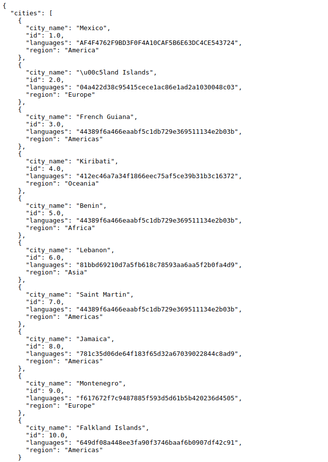

# Tangelo Challenge Python

Los detalles del reto están disponibles  [aquí](https://gitlab.sg-zinobe.com/oscar.mendez/challenge-python-l1)


## ¿Cómo funciona?

Despues de clonar:

1.- Crear un entorno virtual e instalar las dependencias del proyecto:

```bash
$ virtualenv .env 
$ source .env/bin/activate
(.env)$ pip install -r requirements.txt
```

2.- Ejecutar el archivo CLI:

```bash 
$ python cli.py
```

El archivo cli.py eson todos los pasos de la prueba.

## Test

Opcional se pueden ejecutar los test con:


```bash 
$  python -m unittest discover tests/
```


# Flask API

Ejecutar:

```bash
$  python main.py
```

Visitar  http://127.0.0.1:5000/city




